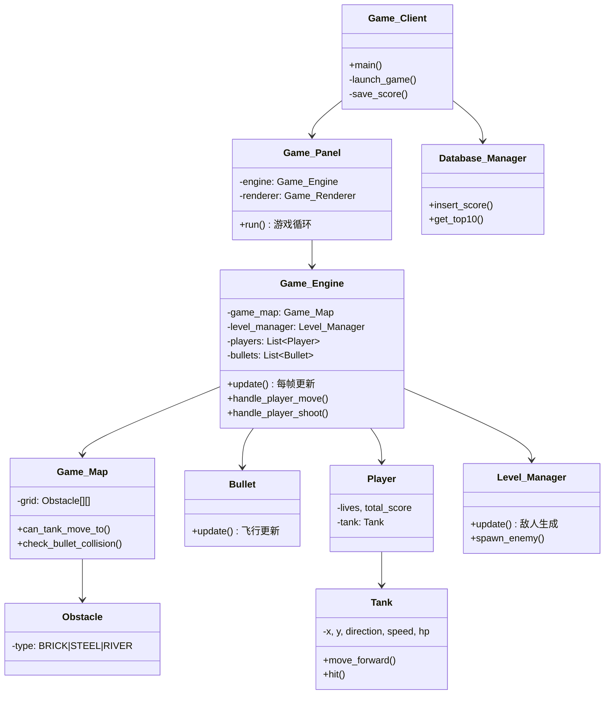

## 一、项目名称

《坦克大战》游戏的设计与实现

---

## 二、项目成员

Vichien： 系统架构设计、游戏引擎开发
Zeng. J.Y： 客户端界面开发、数据库设计与实现
Chen W.F.： 游戏关卡设计、测试调试

---

## 三、项目内容

### 项目背景介绍

本项目实现了一款经典风格的**坦克大战**游戏；玩家操控坦克在地图中移动、射击、消灭敌方坦克以通关；游戏支持**单人或双人协作**两种玩家模式；击杀数据通过 SQLite 持久化存储，支持 TOP 10 排行榜功能。

---

## 项目涉及的知识点

### Java 面向对象编程（OOP）

| 知识点                             | 应用位置                                                                                              | 具体说明                                                                           |
| ------------------------------- | ------------------------------------------------------------------------------------------------- | ------------------------------------------------------------------------------ |
| **封装（Encapsulation）**           | MODEL/Tank.java、MODEL/Bullet.java、MODEL/Player.java 等                                             | 所有实体类字段均使用 private 修饰，通过 getter/setter 方法控制访问，保证数据安全性与一致性                      |
| **继承（Inheritance）**             | CLIENT/UI/Settings_Dialog.java 等                                                                  | 所有对话框继承 JDialog，主窗口继承 JFrame，输入处理器继承 KeyAdapter，充分利用 Swing 组件层次结构              |
| **多态（Polymorphism）**            | CLIENT/UI/ 对话框集合                                                                                  | 不同的 JDialog 子类重写构造逻辑实现各自 UI 布局，但共享 setVisible()、dispose() 等父类方法                |
| **枚举类型（Enum）**                  | COMMON/Constants.java                                                                             | 定义了 Direction、ObstacleType、EnemyType、Game_Mode、Player_Mode 五个枚举，使状态管理类型安全、可读性强 |
| **接口与回调（Interface & Callback）** | ENGINE/Game_Engine.java:GameEventListener                                                         | 定义 GameEventListener 内部接口，通过回调实现引擎事件（通关/阵亡/高分）向 UI 层的解耦通知                      |
| **方法重载与覆写**                     | MODEL/Game_Map.java 的 load_from_array / load_default_map、CLIENT/Game_Client.java 的 paintComponent | Game_Map 提供多种地图加载方式；匿名内部类覆写 paintComponent 绘制初始画面                              |

### Java Swing GUI 编程

| 知识点                       | 应用位置                               | 具体说明                                                               |
| ------------------------- | ---------------------------------- | ------------------------------------------------------------------ |
| **顶级容器**                  | `CLIENT/Game_Client.java`          | 使用 `JFrame` 作为主窗口，设置标题、大小、关闭行为、居中显示                                |
| **中间容器**                  | `CLIENT/Game_Panel.java`           | 继承 `JPanel` 作为游戏主面板，承载游戏循环与渲染                                      |
| **对话框**                   | `CLIENT/UI/` 目录下全部 6 个对话框类         | 使用 `JDialog` 实现模态对话框：设置、通关结算、游戏结束、新纪录、排行榜                          |
| **菜单栏**                   | `CLIENT/UI/Main_Menu_Bar.java`     | 继承 `JMenuBar`，组织「游戏」「设置」「帮助」三级菜单，绑定 `ActionListener`               |
| **布局管理器**                 | 所有 UI 类                            | 综合使用 `BorderLayout`、`BoxLayout`、`FlowLayout`、`GridLayout` 实现界面布局   |
| **事件监听模型**                | `CLIENT/Input_Handler.java`、各对话框按钮 | 键盘事件通过 `KeyListener` 处理，按钮事件通过 `ActionListener` 处理，体现了 Java 事件委托模型 |
| **Graphics2D 绘图**         | `CLIENT/Game_Renderer.java`        | 使用 `Graphics2D` API 实现全部游戏画面的程序化绘制：矩形填充、椭圆、线条、文字、仿射变换旋转            |
| **双缓冲（Double Buffering）** | `CLIENT/Game_Panel.java:run()`     | 使用 `BufferStrategy` 双缓冲主动渲染，消除画面闪烁与撕裂                              |

### Java 多线程编程

| 知识点           | 应用位置                                           | 具体说明                                                              |
| ------------- | ---------------------------------------------- | ----------------------------------------------------------------- |
| **线程创建**      | CLIENT/Game_Panel.java:start_game_loop()       | 通过 new Thread(this, "GameRenderLoop") 创建游戏循环线程，实现 Runnable 接口     |
| **线程同步与可见性**  | `CLIENT/Game_Panel.java:running` 字段            | `running` 使用 `volatile` 关键字声明，保证多线程间的可见性                          |
| **EDT 线程安全**  | `CLIENT/Game_Panel.java:setup_engine_events()` | 引擎回调中使用 `SwingUtilities.invokeLater()` 将 UI 更新任务派发到事件分派线程（EDT）    |
| **线程中断与优雅退出** | `CLIENT/Game_Panel.java:stop_game()`           | `game_thread.join(500)` 等待线程结束，配合 `InterruptedException` 捕获实现优雅停止 |
| **并发集合**      | `ENGINE/Game_Engine.java:bullets`              | 使用 `CopyOnWriteArrayList` 存储子弹列表，避免游戏循环线程与碰撞检测的并发修改异常             |
| **线程休眠**      | `CLIENT/Game_Panel.java:run()`                 | `Thread.sleep(1)` 释放 CPU 时间片，避免空转占用过多资源                           |

---

### 项目功能需求设计

- 双模式 => 正常模式逐关挑战，自选模式可自定义敌人速度、数量、BOSS
- 双人协作 => 玩家一（WASD + J）与 玩家二（方向键 + Enter）同屏操作
- 五种敌坦 => 普通、快速子弹、快速移动、重型、BOSS，各有不同属性与分值
- 三种障碍物 => 砖墙（可摧毁）、铁墙（不可摧毁）、河流（子弹可穿过）
- 排行榜 => SQLite 存储 TOP 10，支持历史最高分与新纪录提示
- 暂停或继续 => P 键随时暂停

---

### 项目设计方案

#### 项目采用分层架构，自上而下分为四层

| 层级     | 包路径           | 职责说明                      |
| ------ | ------------- | ------------------------- |
| COMMON | `COMMON`      | 全局常量（窗口尺寸、速度等）和枚举类型定义     |
| MODEL  | `MODEL`       | 游戏实体类：坦克、子弹、障碍物、地图、玩家数据   |
| ENGINE | `ENGINE`      | 核心游戏逻辑：主循环更新、碰撞检测、AI、关卡管理 |
| CLIENT | `CLIENT`/`UI` | Swing GUI 渲染、键盘输入、对话框、菜单栏 |

#### 主要类的关系



#### 常量与枚举定义（COMMON/Constants）

全局常量定义了窗口尺寸、游戏区域尺寸、单元格大小、坦克尺寸、移动速度、刷新间隔等关键参数，同时定义了 4 个核心枚举

- Direction -- UP, DOWN, LEFT, RIGHT
- ObstacleType -- 障碍物类型：BRICK（砖墙，可摧毁）、STEEL（铁墙，不可摧毁）、RIVER（河流，子弹可穿过）
- EnemyType -- 敌坦类型：每种类型拥有 score、spawn_weight、hits_required、bullet_speed

#### 模型层（MODEL）

##### 坦克类（Tank）

Tank 是游戏核心实体，同时承载玩家和敌方坦克的数据。关键属性包括坐标、方向、速度、生命值、子弹速度、冷却等

```java
// 坦克移动方法
public void move_forward() {
    moving = true;
    move_frame++;
    switch (direction) {
        case UP:    y -= speed; break;
        case DOWN:  y += speed; break;
        case LEFT:  x -= speed; break;
        case RIGHT: x += speed; break;
    }
}

// 被击中
public void hit() {
    hp--;
    if (hp <= 0) { alive = false; }
}
```

##### 子弹类（Bullet）

子弹按方向自动飞行，每次 update() 根据方向和速度更新坐标；子弹有 owner_id 和 from_player 标记，用于碰撞检测时区分友伤

```java
// 子弹每帧更新
public void update() {
    switch (direction) {
        case UP:    y -= speed; break;
        case DOWN:  y += speed; break;
        case LEFT:  x -= speed; break;
        case RIGHT: x += speed; break;
    }
}
```

##### 障碍物类（Obstacle）

基于网格坐标（col, row），提供碰撞矩形 get_bounds() 以及可穿透/可摧毁判断；河流允许子弹穿过但阻挡坦克；砖墙可被子弹摧毁；铁墙完全阻挡且不可摧毁

##### 地图类（Game_Map）

使用 Obstacle[][] 二维数组存储地图，支持 can_tank_move_to() 边界+障碍物碰撞检测，check_bullet_collision() 返回子弹碰撞的障碍物

```java
// 坦克移动碰撞检测
public boolean can_tank_move_to(int x, int y, int width, int height) {
    if (x < 0 || y < 0 || x + width > cols * cell_size
                     || y + height > rows * cell_size) {
        return false; // 边界检测
    }
    java.awt.Rectangle tank_rect = new java.awt.Rectangle(x, y, width, height);
    for (Obstacle obs : get_all_obstacles()) {
        if (tank_rect.intersects(obs.get_bounds())) return false;
    }
    return true;
}
```

##### 关卡数据类（Level_Data）

定义标准八关的难度梯度配置

| 关卡  | 敌人速度   | 敌人数量 | BOSS |
| --- | ------ | ---- | ---- |
| 1–2 | 慢速 (1) | 20   | 无    |
| 3   | 慢速 (1) | 20   | 有    |
| 4–5 | 中速 (2) | 25   | 无    |
| 6   | 中速 (2) | 25   | 有    |
| 7   | 快速 (3) | 30   | 无    |
| 8   | 快速 (3) | 30   | 有    |

#### 引擎层（ENGINE）

##### 游戏引擎（Game_Engine）

Game_Engine 是游戏逻辑的枢纽，update() 方法每帧执行以下流程

```java
// 游戏主更新循环
public Game_State update() {
    if (!running || paused || game_over) return build_game_state();
    if (stage_advance_pending) { /* 进入下一关 */ }

    level_manager.update(game_map);   // ① 敌坦生成刷新
    update_ai();                       // ② AI 行为（移动+射击）
    update_bullets();                  // ③ 子弹位置更新
    check_collisions();                // ④ 碰撞检测
    check_player_deaths();             // ⑤ 玩家死亡与复活
    if (level_manager.is_stage_cleared()) { /* ⑥ 通关检查 */ }

    return build_game_state();         // ⑦ 构建状态快照
}
```

碰撞检测分三步：子弹 vs 障碍物（砖墙摧毁、铁墙阻挡）→ 子弹 vs 坦克（玩家子弹命中敌坦加分、敌方子弹命中玩家减命）→ 坦克 vs 坦克互撞（双方摧毁）

```java
// 子弹与坦克碰撞
if (b.is_from_player()) {
    // 玩家子弹 vs 敌方坦克
    for (Tank enemy : level_manager.get_active_enemies()) {
        if (!enemy.is_alive()) continue;
        if (bullet_rect.intersects(enemy.get_bounds())) {
            enemy.hit();
            b.set_active(false);
            if (!enemy.is_alive()) {
                // 加分、统计击杀
                for (Player p : players) p.add_score(type.score);
                level_manager.on_enemy_defeated();
            }
            break;
        }
    }
} else {
    // 敌方子弹 vs 玩家坦克
    for (Player p : players) {
        Tank pt = p.get_tank();
        if (bullet_rect.intersects(pt.get_bounds())) {
            pt.set_alive(false);
            p.lose_life();
        }
    }
}
```

AI 行为：敌坦每隔随机帧改变方向；碰墙时随机转向；冷却结束后随机射击。

```java
// AI 更新
private void update_ai() {
    for (Tank enemy : level_manager.get_active_enemies()) {
        enemy.decrement_cooldown();
        if (random.nextInt(60) == 0)     // 随机转向
            enemy.set_direction(dirs[random.nextInt(4)]);
        enemy.move_forward();             // 尝试移动
        if (!game_map.can_tank_move_to(...)) {
            enemy.set_position(old_x, old_y); // 碰墙退回
            enemy.set_direction(dirs[random.nextInt(4)]);
        }
        if (enemy.get_shoot_cooldown() <= 0 && random.nextInt(40) == 0)
            fire_bullet(enemy);           // 随机射击
    }
}
```

##### 关卡管理器（Level_Manager）

负责敌坦的定时刷新（每 120 帧一次，最多 6 个同时在场）、按权重随机选择敌坦类型、BOSS 在最后一波生成；使用 is_stage_cleared() 判断消灭计数是否达到关卡总数

```java
// 敌人类型权重随机选择
private EnemyType select_enemy_type() {
    float roll = random.nextFloat();
    float cumulative = 0;
    EnemyType[] types = {NORMAL, FAST_BULLET, FAST_MOVE, HEAVY};
    for (EnemyType t : types) {
        cumulative += t.spawn_weight;
        if (roll <= cumulative) return t;
    }
    return EnemyType.NORMAL;
}
```

##### 数据库管理器（Database_Manager）

使用 SQLite JDBC 驱动管理 rankings 表（玩家名、分数、日期）；核心功能包括：can_enter_ranking()、insert_score()、get_top10()

```java
// 数据库建表
String sql = "CREATE TABLE IF NOT EXISTS rankings (" +
    "id INTEGER PRIMARY KEY AUTOINCREMENT, " +
    "player_name TEXT NOT NULL, " +
    "score INTEGER NOT NULL, " +
    "play_date TEXT DEFAULT (datetime('now','localtime'))" +
")";
```

##### 游戏状态快照（Game_State）

分离渲染层与逻辑层的数据结构；引擎每帧构建 Game_State（包含玩家状态、敌方坦克状态、子弹状态、障碍物列表、击杀统计等），渲染器基于快照绘制，实现数据与视图解耦

#### 客户端层（CLIENT）

##### 主窗口（Game_Client）

继承 JFrame，管理窗口生命周期；提供菜单栏（新游戏/设置/排行榜/帮助）、游戏启动流程（start_new_game → Settings_Dialog → launch_game）、分数保存、菜单重置等

##### 游戏面板（Game_Panel）

实现 Runnable，运行在独立线程中；采用**固定时间步长**的游戏循环（60 FPS 逻辑更新），使用 BufferStrategy 双缓冲主动渲染减少画面撕裂

```java
// 游戏主循环
while (running) {
    long now = System.nanoTime();
    delta += (now - last_tick) / ns_per_tick; // ns_per_tick = 1e9/60
    last_tick = now;

    while (delta >= 1) {
        update();      // 逻辑更新
        delta--;
    }
    render(bs);        // 渲染
    frame_count++;
    Thread.sleep(1);
}
```

##### 游戏渲染器（Game_Renderer）

纯 Graphics2D 绘制，不依赖外部图片资源；绘制流程：黑色背景 → 深灰网格线 → 障碍物（砖墙/铁墙/河流各有不同纹理）→ 敌方坦克 → 玩家坦克 → 子弹 → 关卡标题 → 右侧信息面板

坦克使用 AffineTransform 旋转变换实现四个方向的炮管朝向

```java
// 坦克渲染（带旋转）
AffineTransform old = g.getTransform();
g.translate(x + tw/2.0, y + th/2.0);
g.rotate(angle);                          // 按方向旋转
g.setColor(color);
g.fillRect(-tw/2, -th/2, tw, th);        // 车身
g.fillRect(-tw/2, -th/2, 5, th);         // 左履带
g.fillRect(tw/2-5, -th/2, 5, th);        // 右履带
g.fillRect(-3, -th/2-8, 6, 12);          // 炮管
g.fillOval(-4, -4, 8, 8);                // 中心
g.setTransform(old);
```

##### 输入处理器（Input_Handler）

继承 KeyAdapter，使用 HashSet<Integer> 维护当前按下的按键集合，支持 持续按键移动（按住 W 持续前进）和 单次射击（按 J）；P1：WASD + J；P2：方向键 + Enter；全局 P 键暂停

颜色编码

| 实体     | 颜色  | 说明          |
| ------ | --- | ----------- |
| 玩家 1   | 黄色  | P1 坦克       |
| 玩家 2   | 绿色  | P2 坦克       |
| 普通敌人   | 浅蓝  | NORMAL      |
| 快速子弹敌人 | 粉色  | FAST_BULLET |
| 快速移动敌人 | 红色  | FAST_MOVE   |
| 重型敌人   | 草绿  | HEAVY       |
| BOSS   | 深蓝  | BOSS（6 命）   |
| 砖墙     | 棕色  | 可摧毁         |
| 铁墙     | 灰色  | 不可摧毁        |
| 河流     | 蓝色  | 子弹可穿过       |

---

## 关键技术点

### 碰撞检测系统

采用 java.awt.Rectangle.intersects() 进行 AABB 碰撞检测，实现三级碰撞链：

1. **移动前检测**：can_tank_move_to() 检查目标位置是否与地图边界/障碍物碰撞
2. **子弹飞行检测**：子弹每帧更新后检查与障碍物、坦克的碰撞
3. **坦克互撞检测**：玩家与敌坦重叠时双方同时摧毁

### AI 行为系统

敌坦 AI 基于随机策略

- **移动**：每 60 帧有概率转向（1/60）；碰墙后强制随机转向
- **射击**：冷却结束后，每 40 帧有概率射击（1/40）
- **类型多样性**：按权重随机生成 5 种敌坦类型，BOSS 强制在最后一波出现

### 状态快照模式

Game_Engine 每帧构建不可变 Game_State 快照，Game_Renderer 基于快照绘制；这种设计实现了逻辑与渲染的解耦，便于后续扩展（如网络同步、录像回放）

### 双缓冲主动渲染

Game_Panel 使用 BufferStrategy 双缓冲 + 固定 60 FPS 时间步长：

- 逻辑更新与渲染分离，避免卡帧
- do-while 循环处理 contentsLost() / contentsRestored() 保证渲染稳定性

### SQLite 持久化

使用 SQLite JDBC 驱动实现轻量级数据持久化，无需额外安装数据库；自动维护 TOP 10 排行榜，插入新纪录后裁剪超出部分

### 持续按键支持

Input_Handler 维护 HashSet<Integer> 按键集合，Game_Panel.update() 中每帧检测持续按压的移动键，实现流畅的坦克移动控制

---

## 项目目录结构

```
TANK_GAME/
└── src/
    ├── Main.java                 ← 程序入口
    ├── SQLite_JDBC.jar           ← SQLite JDBC 驱动
    ├── COMMON/
    │   └── Constants.java        ← 全局常量与枚举
    ├── MODEL/
    │   ├── Tank.java             ← 坦克实体
    │   ├── Bullet.java           ← 子弹实体
    │   ├── Obstacle.java         ← 障碍物实体
    │   ├── Game_Map.java         ← 游戏地图
    │   ├── Player.java           ← 玩家数据
    │   └── Level_Data.java       ← 关卡配置
    ├── ENGINE/
    │   ├── Game_Engine.java      ← 游戏引擎（核心）
    │   ├── Level_Manager.java    ← 关卡管理器
    │   ├── Database_Manager.java ← 数据库管理
    │   └── Game_State.java       ← 状态快照
    └── CLIENT/
        ├── Game_Client.java      ← 主窗口
        ├── Game_Panel.java       ← 游戏面板+循环
        ├── Game_Renderer.java    ← 渲染器
        ├── Input_Handler.java    ← 输入处理
        └── UI/
            ├── Settings_Dialog.java
            ├── Stage_Clear_Dialog.java
            ├── Game_Over_Dialog.java
            ├── High_Score_Dialog.java
            ├── Record_Dialog.java
            └── Main_Menu_Bar.java
```

---

## 四、总结

本次坦克大战课程设计，是一次从零开始、完整走完「需求分析 → 架构设计 → 编码实现 → 测试调优」全流程的实战训练。通过这个项目，我们在以下方面有了切实的成长：

- **面向对象思维的真正落地**：课堂上学到的封装、继承、多态，在项目中变成了实实在在的设计决策。比如将 Tank 设计为玩家和敌坦的共用基类，用 Game_State 快照解耦逻辑与渲染，都是反复权衡后的选择
- **分层架构的价值**：将项目拆分为 COMMON / MODEL / ENGINE / CLIENT 四层后，每个模块职责清晰、改动互不影响——修改碰撞逻辑时完全不用碰渲染代码，新增敌坦类型只需改枚举和常量
- **游戏循环与时间步长的理解**：实现 60 FPS 固定时间步长主循环时，深刻体会到「逻辑帧」与「渲染帧」分离的重要性——如果混在一起，快慢机器上的游戏体验会完全不同
- **从 Bug 中学习**：双缓冲渲染时画面闪烁、子弹出界不销毁导致性能下降、AI 坦克卡墙角无限转圈等这些 Bug 的排查过程，远比课堂上的示例代码更锻炼人

### 遇到的困难与解决

| 困难              | 解决思路                                                                                                    |
| --------------- | ------------------------------------------------------------------------------------------------------- |
| **双缓冲闪烁**       | 最初直接在 paintComponent 中绘制，高帧率下画面撕裂严重。改用 BufferStrategy 主动渲染 + contentsLost / contentsRestored 循环保证后才彻底解决 |
| **碰撞检测遗漏**      | 早期只做了子弹-坦克碰撞，忽略了子弹-障碍物、坦克-坦克互撞。后来整理出「三级碰撞链」（障碍物→子弹→坦克→坦克互撞），按顺序逐级检测，逻辑才清晰起来                             |
| **AI 行为过于单一**   | 初版敌坦只会直走，游戏毫无挑战性。引入随机转向（1/60 概率）、碰墙换向、随机射击（冷却 + 概率）后，敌人行为才像一个真正的「对手」                                    |
| **SQLite 并发问题** | 游戏循环线程中直接写库偶尔报 SQLITE_BUSY。将数据库操作全部收敛到 EDT 线程（通过对话框事件触发），避免了多线程竞争                                       |
| **多击坦克的血条显示**   | HEAVY（4 命）和 BOSS（6 命）需要直观展示剩余血量。在渲染器中为多击坦克添加了红色血条叠加层，让玩家一眼看出还需击中几次                                      |

### 团队协作体会

三人合作开发中，我们采用以下分工模式：

- **模型层 + 引擎层**（核心逻辑）由一人主责，保证数据结构一致性
- **客户端层 + UI 对话框**由另一人负责界面与交互
- **测试、文档、调试** 由第三人同步推进

过程中最大的体会是：接口约定比代码量更重要。比如 Game_Engine 暴露的 GameEventListener 回调接口，在写引擎时一次性定义好，后续 UI 层的同学完全不需要了解引擎内部实现，只需实现接口即可串联整个游戏流程。这种「面向接口编程」的体验，是本次课程设计最有价值的一课

### 不足与改进方向

- **地图单一**：目前只有一张硬编码的默认地图，后续可设计地图编辑器或随机地图生成算法
- **AI 智能度低**：当前 AI 完全随机，没有追踪玩家的能力，可引入简单的寻路策略或朝向玩家射击
- **音效缺失**：射击、爆炸、通关等音效能大幅提升游戏沉浸感
- **网络对战**：现有架构的状态快照设计已为网络同步打下基础，可扩展为 PvP 对战模式
- **代码复用**：Game_Renderer 中有较多重复的绘制代码，可进一步抽象为可复用的绘制工具类

### 结语

从一个简单的「坦克能动了」到最终「80 个敌人、5 种类型、8 关挑战、双人协作、排行榜一应俱全」，一行行代码见证了整个学期的积累与成长；Java 不再只是课本上的语法和概念，而是变成了屏幕上会移动、会射击、会爆炸的坦克。感谢这次课程设计带来的挑战与收获
